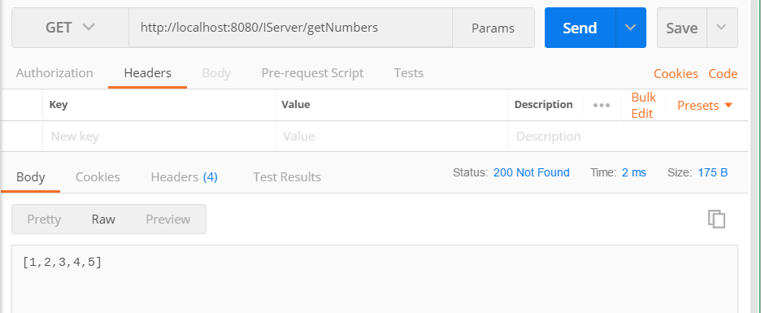

# Raw Http Communication 

Clients other than Fable can communicate with a server using Fable.Remoting quite easily using raw http requests. For that, we have to understand how the functions of the record implementation is translated to Http. These functions can have the following pattern:
```fs
Async<'A> 
'A -> Async<'B>
'A -> 'B -> Async<'C>
'A -> 'B -> 'C -> Async<'D>
// etc. 
``` 
Lets take the following protocol and implementation as an example:
```fs
type ListsRecord = {
    firstList : int list 
    secondList : int list  
}

type IServer = {
    getNumbers : Async<int list>  
    concatLists : ListsRecord -> Async<int list> 
}
```
Notice that the field `getNumbers` is a simple async value and does not require input parameters, while `concatLists` needs a record as input. Now let us provide a simple implementation and run the server:
```fs
let server = { 
    getNumbers = async { return [1 .. 5] }
    concatLists = fun input -> async {
        return List.concat [input.firstList; input.secondList]
    }
}

let webApp = 
    Remoting.createApi()
    |> Remoting.fromValue server 
    |> Remoting.buildWebPart 

startWebServer defaultConfig webApp 
```
Now, to invoke `getNumbers` using raw http request you can send a `GET` request (because no parameters are required) to the default field url `/IServer/getNumbers`:



As simple as that. This rule of `No parameters <=> GET request` also applies to functions where the input is `unit`, i.e. functions of type `unit -> Async<'t>`. 

Now moving on to the function `concatLists`, it has one parameter of type `ListsRecord`. By convention, we will send `POST` requests with the parameters as a JSON array that contains the serializable data. The entries of the array correspond with the arguments of the function:


Functions of a single parameter such as `concatLists` are special: you don't always need to wrap their parameter in an array, so it will work as well when you send just the serializable input object without an array:


This rule only applies when the function has a single parameter and when the parameter is not array-like is serialized form, this means the rule doesn't apply to arrays, lists or tuples because of ambiguity and you would have to wrap these arguments in an array just like in the situation with multiple parameters.   